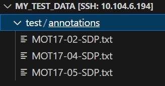

# Easier to use TrackEval 

## 😆O. 最近更新

***2024.12.14***: 重新整理整个框架, 并解决了过去没有考虑数据集中ignore region, truncation和occlusion导致FP过高(MOTA过低)的问题[This Issue](https://github.com/JackWoo0831/Easier_To_Use_TrackEval/issues/13#issuecomment-2540488858), 以及支持多类别评测[This Issue](https://github.com/JackWoo0831/Easier_To_Use_TrackEval/issues/19)

## 😀I. 仓库说明

鉴于[TrackEval](https://github.com/JonathonLuiten/TrackEval)库写的略有些复杂, 可能对初学者不太友好, 因此我想简单优化一下, **让评估自定义的数据集更加方便.**

跑通代码最重要的就是路径问题, 为此我写了两个config模板, 让配置路径更简单.

***仅支持2D MOT数据集***

## 😘II. 当前的数据集支持

### 1. 🗺️MOT17

MOT17只有训练集有标注. 如果您想用`MOT17-half`做测试, 可能需要修改一些代码.

使用MOT17, 需要修改`./configs/MOT17_train.yaml`的`data_root`参数, 设置为您的数据集路径, 

并且修改`tracker_structure_config`的`trackers_folder`参数, 设置为您的跟踪结果所在的位置

然后运行:

```bash
python scripts/run_custom_dataset.py --config_path configs/MOT17_trian.yaml
```

为了将跟踪结果和真值对应, 请您保证您的跟踪结果的每一行遵循如下格式:

```
<frame id>,<object id>,<top-left-x>,<top-left-y>,<w>,<h>,<confidence score>,-1,...
```

### 2. 🗺️VisDrone

注意VisDrone可以**单类评测**, 也可以**多类评测**.

若单类评测, 请您先运行

```bash
python dataset_tools/merge_visdrone_categories.py --data_root <your visdrone data root>
```

来将VisDrone规定的五个有效类别合并成为一个有效类别, 从而一起评测

单类评测, 运行:

```bash
python scripts/run_custom_dataset.py --config_path configs/VisDrone_test_dev_merge_class.yaml
```

多类评测, 运行:

```bash
python scripts/run_custom_dataset.py --config_path configs/VisDrone_test_dev.yaml
```

同理, 您同样需要修改yaml文件中的`data_root`和`trackers_folder`来指定您的ground truth和跟踪结果文件夹.

对于单类评测, 请您保证您的跟踪结果每一行遵循如下格式:

```
<frame id>,<object id>,<top-left-x>,<top-left-y>,<w>,<h>,<confidence score>,-1,...
```

对于多类评测, 请您保证您的跟踪结果每一行遵循如下格式:

```
<frame id>,<object id>,<top-left-x>,<top-left-y>,<w>,<h>,<confidence score>,<class_id>,...
```

❗❗注意, 在多类评测的过程中, 您跟踪结果中的`class_id`必须和真值标注的**完全一致**. 比如VisDrone, 有效的类别id是`1, 4, 5, 6, 9`(对应pedestrian, car, van, truck, bus), 那么您的跟踪结果的class id部分也必须是对应的`1, 4, 5, 6, 9`, 而不是检测器直接得出的`0, 1, 2, 3, 4`. 这需要您自行修改跟踪代码中写跟踪结果的那部分代码.

### 3. 🗺️UAVDT

UAVDT数据集的标注分为三个文件, `gt.txt, gt_whole.txt, gt_ignore.txt`. 其中`gt.txt`是主要的标注, 而`gt_ignore.txt`是应该忽略的区域的标注. 因此, 我们应该合并这两个文件, 来**排除忽略区域内的匹配, 否则会造车过大的FP**. 运行:

```bash
python dataset_tools/parse_uavdt_annotations.py --data_root <your uavdt data root>
```

随后运行

```bash
python scripts/run_custom_dataset.py --config_path configs/UAVDT_test.yaml
```

同理, 您同样需要修改yaml文件中的`data_root`和`trackers_folder`来指定您的ground truth和跟踪结果文件夹. 注意, UAVDT一共有50个视频, 其中20个视频为测试集, 也就是`UAVDT_test.yaml`中的.

请您保证您的跟踪结果的每一行遵循如下格式:

```
<frame id>,<object id>,<top-left-x>,<top-left-y>,<w>,<h>,<confidence score>,-1,...
```

## 😊III. 自定义数据集的评测: Config的解释

所有数据集的评测配置文件都存储在`./configs`下, 下面来逐一解释里面的信息. 如果您需要评测自定义的数据集, 您只需要按照下述解释自定义`config`即可.

### ✅1. gt_structure_config

❗这部分是**关键**, 即配置你的数据集的ground truth的路径. 

一般MOT的数据集的目录结构可以分为两大类(如果有别的以后还会补充), **一个是像MOT Challenge这样的(例如: UAVDT)**

```
# ${data_root}:
#    |
#    |___${train_folder_name}(Optional)
#          |
#          |____${seq_name}
#                     |_______${image_folder}
#                                    |____${frame_name}
#                     |_______${gt_folder_name}
#                                    |____${gt_txt_name}
#    |___${test_folder_name}(Optional)
#          |
#          |____${seq_name}
#                     |_______${image_folder}
#                                    |____${frame_name}
#                     |_______${gt_folder_name}   
#                                    |____${gt_txt_name}
```

例如, 如果我的MOT17数据集在`/data/datasets/`下, 其中的值就是:
```
data_root: /data/datasets/MOT17

train_folder_name: train, # 训练集文件夹名称
seq_name: MOT17-02-DPM, ..., MOT17-13-SDP,  # 序列名称
image_folder: img1,  # 存放序列帧图像文件夹的名称
frame_name： 000001.jpg, ..., 000600.jpg, ... ,  # 图片名称
gt_folder_name: gt  # 真值文件夹名称
gt_txt_name: gt.txt  # 真值文件的名称

test_folder_name: test
...同上

```

当然, 有的数据集没有划分训练集和测试集, 因此`train_folder_name`, `train_folder_name`也可以没有, 例如UAVDT数据集.


**另一种是类似于yolo格式: (例如, Visdrone)**

```
# ${data_root}:
#    |
#    |___${train_folder_name}(Optional)
#          |
#          |____${seq_folder_name}
#          |          |_______${seq_name}
#          |                         |____${frame_name}
#          |____${gt_folder_name}
#                     |____${gt_txt_name}
#    |___${test_folder_name}(Optional)
#          |
#          |____${seq_folder_name}
#          |          |_______${seq_name}
#          |                         |____${frame_name}
#          |____${gt_folder_name}
#                     |____${gt_txt_name}
```

例如, Visdrone的测试集目录结构如下(训练集测试集同理):


在该目录结构中, 真值文件夹和序列文件夹是平级的, 而不是包含在某个序列中. 因此对于Visdrone, 目录结构中的值如下:

```
data_root: /data/datasets/VisDrone

train_folder_name: VisDrone2019-MOT-train, # 训练集文件夹名称
seq_folder_name: sequences  # 存放序列的文件夹的名称
seq_name: uav0000013_00000_v, ...,  # 序列名称
frame_name： 0000002.jpg, ..., 00000200.jpg, ... ,  # 图片名称
gt_folder_name: annotations  # 真值文件夹名称
gt_txt_name: {seq_name}.txt  # 真值文件的名称, 与序列名称有关, 写成格式化字符串形式

test_folder_name: test
...同上

```

❗❗***您只需按照以下步骤设置:***


选择一个数据集的目录结构模板(`configs/template1.yaml`或者`configs/template2.yaml`), 然后按照您的数据集的文件夹名称填入`gt_structure_config`中对应的值, 

> 注意, `gt_loc_format`需要谨慎检查, 它的意思是找到一个序列的真值txt的路径. 这是一个格式化的字符串, 里面的变量是`gt_structure_config`中的变量, 因此名称要保持一致. 如果您的数据集有轻微的差别, 也仅仅需要修改这个地方. 

### ✅2. tracker_structure_config

这部分的意思是您的跟踪结果文件的目录结构. 通常您只需要修改`trackers_folder`即可, 其他的保持不变. 比如您的跟踪结果在`./result/my_tracker`下面, 则将`trackers_folder`设置为`./result/my_tracker`

### ✅3. OUTPUT_FOLDER

表示TrackEval输出文件的存放目录

### ✅4. SEQ_INFO

记录序列的信息. 格式为

```
sequence name: sequence length
```

### ✅5. CLASS_NAME_TO_CLASS_ID

表示类别名称和类别ID的映射, 这部分以数据集规定为准. 如果您自定义了合并类别, 这部分也要修改. 

### ✅6. CLASSES_TO_EVAL

要评测哪个类别. 其他的类别都会被舍弃.

### ✅7. DISTRACTOR_CLASSES_NAMES

有可能干扰感兴趣类别的其他类别, 也就是容易混淆的类别, 也会被舍弃. 例如, 在MOT17中, 与pedestrian容易干扰的类别就是person(表示静止的人). 如果不需要, 就设置为空.

### ✅8. AS_SINGLE_CLASS

是否要将所有跟踪的结果设定为一个类别. 这样做的结果就是不再按类别去筛选跟踪结果, 而是都考虑. 这有时有用, 例如您在单/多类评测切换的时候, 不需要重新再跑一个跟踪结果.

`enabled`: true or false, 表示是否启用.

`single_class_id`: int, 表示你要设置成的类别id.

### ✅9. ZERO_MARK

一些数据集(例如MOT17和VisDrone)的ground truth中专门有一列是代表score, 即0表示不考虑这个gt, 而1考虑这个gt. 如果启用ZERO_MARK, 就会舍弃score这一列为0的gt.

`enabled`: true or false, 表示是否启用.

### ✅10. CROWD_IGNORE_REGION

一些数据集(例如MOT17和VisDrone)的类别中有ignore region类, 这些区域一般是应该忽略的区域(例如很远的地方).

`enabled`: true or false, 表示是否启用.

`col_idx`: int, 表示真值标注中的哪一列(通常是类别那一列)
`class_id`: List[str], 表示ignore region的类别id是什么, 注意转换成字符串格式

### ✅11. TRUNCATION

表示截尾标注. 在评测中可以忽略截尾过大的目标. 

`enabled`: true or false, 表示是否启用.

`thresh`: int or float, 表示阈值, 大于该阈值的会被舍弃

### ✅12. OCCLUSION

表示遮挡标注. 在评测中可以忽略遮挡过大的目标.

`enabled`: true or false, 表示是否启用.

`thresh`: int or float, 表示阈值, 大于该阈值的会被舍弃

### ✅13. COL_IDX_MAP

在ground truth中, 每一列的含义与其对应的列索引


### ✅14. FRAME_START_IDX

int, 表示ground truth中的帧id是从0开始还是1开始.

## 😉IV. 一个示例


下面用一个小demo来演示一下. 我选取了MOT17数据集的几个标注文件, 作为真值, 同时作为我的模型的跟踪结果. 

假设数据集的目录为`/data/datasets/my_test_data`, 其结构如下:




同时, 我将跟踪结果放在当前目录`./result/demo`下.

然后, 配置文件按照`./configs/demo.yaml`配置.

然后运行:

```bash
python scripts/run_custom_dataset.py --config_path configs/demo.yaml
```

运行结果:

