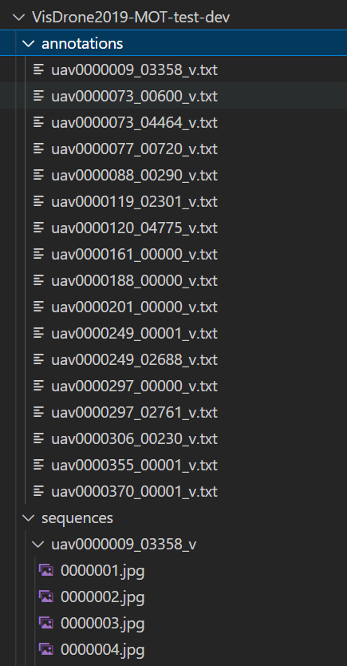

# Easier to use TrackEval 

## I. 仓库说明

鉴于[TrackEval](https://github.com/JonathonLuiten/TrackEval)库写的略有些复杂, 可能对初学者不太友好, 因此我想
简单优化一下, **让评估自定义的数据集更加方便.**

跑通代码最重要的就是路径问题, 为此我写了两个config模板, 让配置路径更简单.

***仅支持2D MOT数据集***

## II. 使用方法

### 目录结构

一般MOT的数据集的目录结构可以分为两大类(如果有别的以后还会补充), **一个是像MOT Challenge这样的(例如: UAVDT)**

```
# ${data_root}:
#    |
#    |___${train_folder_name}(Optional)
#          |
#          |____${seq_name}
#                     |_______${image_folder}
#                                    |____${frame_name}
#                     |_______${gt_folder_name}
#                                    |____${gt_txt_name}
#    |___${test_folder_name}(Optional)
#          |
#          |____${seq_name}
#                     |_______${image_folder}
#                                    |____${frame_name}
#                     |_______${gt_folder_name}   
#                                    |____${gt_txt_name}
```

例如, 如果我的MOT17数据集在`/data/datasets/`下, 其中的值就是:
```
data_root: /data/datasets/MOT17

train_folder_name: train, # 训练集文件夹名称
seq_name: MOT17-02-DPM, ..., MOT17-13-SDP,  # 序列名称
image_folder: img1,  # 存放序列帧图像文件夹的名称
frame_name： 000001.jpg, ..., 000600.jpg, ... ,  # 图片名称
gt_folder_name: gt  # 真值文件夹名称
gt_txt_name: gt.txt  # 真值文件的名称

test_folder_name: test
...同上

```

当然, 有的数据集没有划分训练集和测试集, 因此`train_folder_name`, `train_folder_name`也可以没有, 例如UAVDT数据集.


**另一种是类似于yolo格式: (例如, Visdrone)**

```
# ${data_root}:
#    |
#    |___${train_folder_name}(Optional)
#          |
#          |____${seq_folder_name}
#          |          |_______${seq_name}
#          |                         |____${frame_name}
#          |____${gt_folder_name}
#                     |____${gt_txt_name}
#    |___${test_folder_name}(Optional)
#          |
#          |____${seq_folder_name}
#          |          |_______${seq_name}
#          |                         |____${frame_name}
#          |____${gt_folder_name}
#                     |____${gt_txt_name}
```

例如, Visdrone的测试集目录结构如下(训练集测试集同理):



在该目录结构中, 真值文件夹和序列文件夹是平级的, 而不是包含在某个序列中. 因此对于Visdrone, 目录结构中的值如下:

```
data_root: /data/datasets/VisDrone

train_folder_name: VisDrone2019-MOT-train, # 训练集文件夹名称
seq_folder_name: sequences  # 存放序列的文件夹的名称
seq_name: uav0000013_00000_v, ...,  # 序列名称
frame_name： 0000002.jpg, ..., 00000200.jpg, ... ,  # 图片名称
gt_folder_name: annotations  # 真值文件夹名称
gt_txt_name: {seq_name}.txt  # 真值文件的名称, 与序列名称有关, 写成格式化字符串形式

test_folder_name: test
...同上

```


### All you do is to fill in!


您只需按照以下步骤设置:


1. 选择一个数据集的目录结构模板(`configs/template1.yaml`或者`configs/template2.yaml`), 然后按照您的数据集的文件夹名称填入`gt_structure_config`中对应的值, 

> 注意, `gt_loc_format`需要谨慎检查, 它的意思是找到一个序列的真值txt的路径. 这是一个格式化的字符串, 里面的变量是`gt_structure_config`中的变量, 因此名称要保持一致. 如果您的数据集有轻微的差别, 也仅仅需要修改这个地方. 


设置其他信息: 您的数据集对应的:

序列信息:

```
SEQ_INFO:
  序列名称: 序列长度
```

需要评测的类别名称:

```
CLASSES_TO_EVAL: 
  - 类别1
  - 类别2
  - ...
```

类别名称到类别id的映射关系:

```
CLASS_NAME_TO_CLASS_ID:
  类别名称: 类别id
```

有效类别(和CLASSES_TO_EVAL一致):

```
VALID_CLASS:
  - 类别1
  - 类别2
  - ...

```

设置干扰类别: 
(这部分的作用是将跟踪结果中的这部分类别的结果扣去)

```
DISTRACTOR_CLASSES_NAMES:
  - 类别5
  - 类别6
  - ...
```


2. 将您的跟踪结果放在本工程目录的`./result`下, 如果您要对比多个跟踪器的性能, 按照如下目录设置:

```
result
   |
   |____tracker1_name
              |
              |______{seq_name}.txt...
   |
   |____tracker2_name
              |
              |______{seq_name}.txt...

```

并将`template.yaml`中的`has_tracker_name`设置为`True`

如果不需要, 直接按照如下目录:

```
result
    |
    |______{seq_name}.txt...
```

并将`template.yaml`中的`has_tracker_name`设置为`False`

3. 运行!

将`./run_custom.sh`中命令的template_type参数设置一下, 随后

```bash
bash run_custom.sh
```

## 一个示例


下面用一个小demo来演示一下. 我随便选取了MOT17数据集中的一个txt文件, 作为真值, 同时作为我的模型的跟踪结果. 

随后我放在`/data/datasets/my_test_data`下, 目录结构如下:


可以看出来, 这属于第二种模板. 同时, 我将跟踪结果放在当前目录`./result/seq1.txt`下.

为此, 我设置`template2.yaml`:

```
gt_structure_config: 
  data_root: '/data/datasets/my_test_data/'
  has_split: True
  train_or_test: test
  train_folder_name: train
  test_folder_name: test
  gt_folder_name: annotations
  gt_txt_name: '{seq_name}.txt'  # gt.txt, {seq_name}.txt, etc.
  gt_loc_format: '{data_root}/{split_name}/{gt_folder_name}/{gt_txt_name}' 

tracker_structure_config:
  trackers_folder: './result'
  has_split: False
  split_name: ''
  has_tracker_name: False
  trackers_to_eval:   # None for all


# other options
OUTPUT_FOLDER: './track_eval_output'   # Where to save eval results (if None  same as TRACKERS_FOLDER)

SEQ_INFO:  # seq_name: seq_length
  'seq1': 600

# CLASS configs
CLASSES_TO_EVAL: 
  - 'pedestrian'
  - 'person_on_vehicle'
  - 'car'

CLASS_NAME_TO_CLASS_ID:
  'pedestrian': 1
  'person_on_vehicle': 2
  'car': 3
  'bicycle': 4
  'motorbike': 5
  'non_mot_vehicle': 6
  'static_person': 7
  'distractor': 8
  'occluder': 9
  'occluder_on_ground': 10
  'occluder_full': 11
  'reflection': 12
  'crowd': 13

VALID_CLASS:
  'pedestrian': 1
  'person_on_vehicle': 2
  'car': 3

DISTRACTOR_CLASSES_NAMES:
  - 'person_on_vehicle'
  - 'static_person'
  - 'distractor'
  - 'reflection'
```

之后修改`run_custom.sh`:

```bash
template_type=2

python scripts/run_custom_dataset.py --config_path ./configs/template${template_type}.yaml
```

运行
```bash
bash run_custom.sh
```
运行结果:

